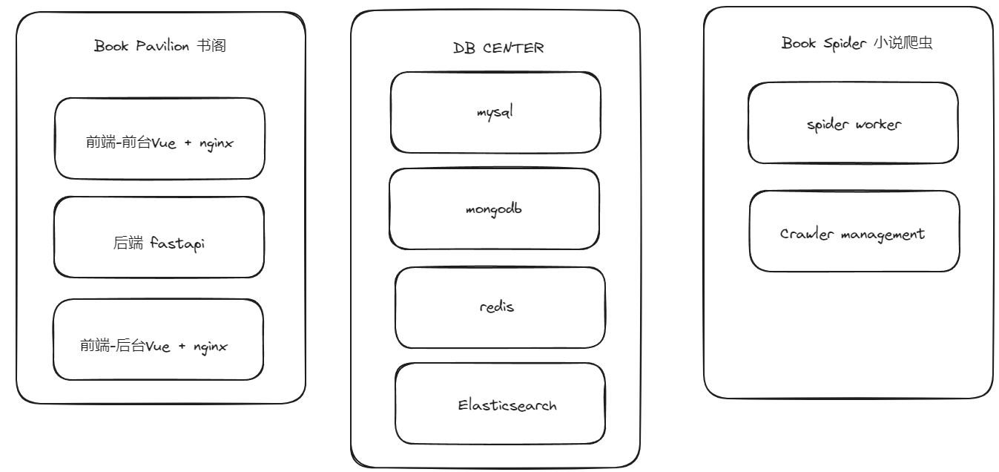
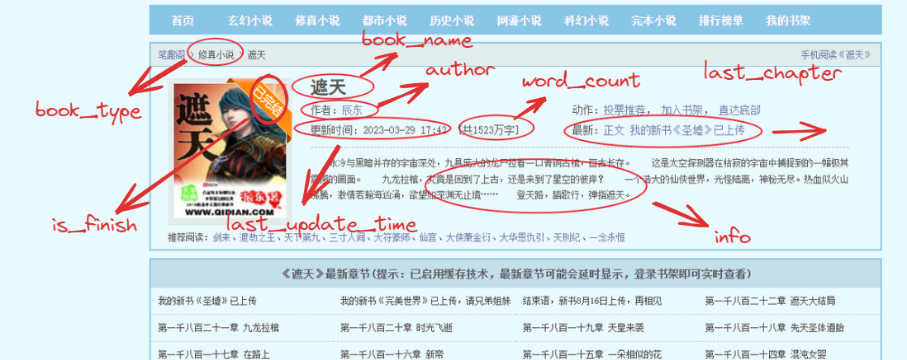
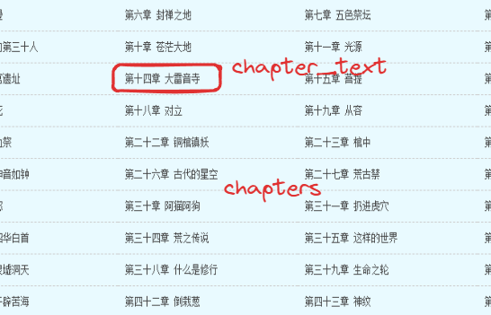
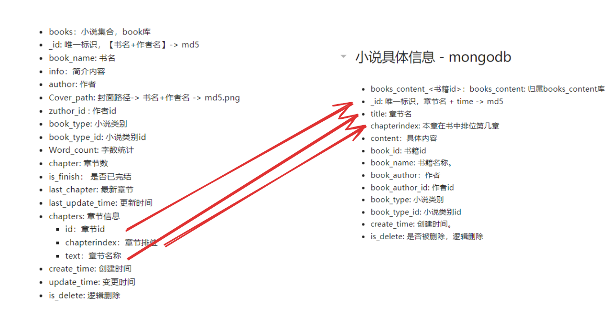
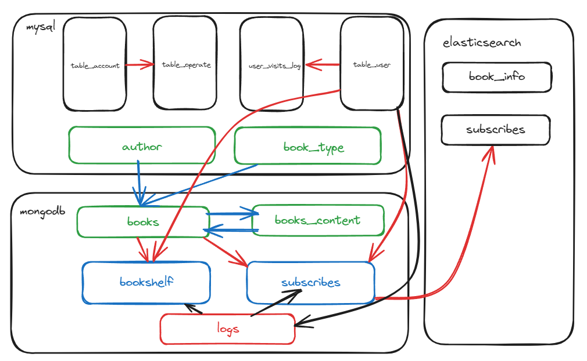
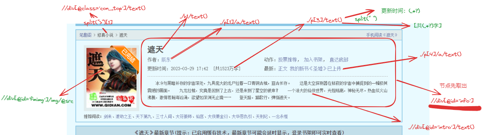
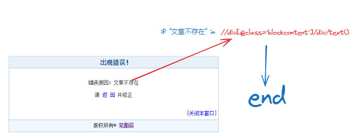

# BookDiscover

- 书探，打造私人书库，增量跟踪小说更新
- 数据源：https://www.bbiquge.la/
- 整体使用 K8S统筹管理部署，大结构分为小说书库、数据爬虫两大模块，其中小说书库采用前后端分离设计，具体设计如下。
- 用到相关技术：
    - k8s v1.20 \ docker：# 高效的容器化部署和管理方案
    - nginx # 常用的 Web 分布式部署服务
    - vue + element-ui 、echarts # 前端框架、ui组件库、图表库
    - fastapi 一种 python 适用于 restful 风格的轻量级快速异步Web api框架 
    - mysql\mongodb\redis\elasticsearch ： 数据库组合 mysql 常见的 关系型数据库，mongodb基于文档存储的 nosql数据库，redis 基于内存的高效键值对缓存数据库、elasticsearch 基于索引的快速搜索引擎数据库
    - scrapy-redis  爬虫框架，构建分布式爬虫系统
 

# 系统结构图

- 总体结构分层
  

- 设计要求：分层隔离，保证系统是高可用、高扩展的。
- 数据库：
     - mysql 负责记录管理系统的相关信息，管理账号、管理日志，用户访问记录，小说作者信息、小说类别信息等。
     - mongodb 负责存储小说信息、小说章节具体信息等。
     - redis 用于在爬虫任务中抽离任务相关参数，作为数据中间件，帮助去重和分布式爬虫任务构建。
     - Elasticsearch 负责快速整合，作者、书籍、类别、章节信息、记录异常日志信息。
- spider worker：
     - 小说信息+章节信息 - worker
     - 小说具体内容抓取  - worker
     - 增量扫描         - worker


# 数据模型设计

## 管理账号-mysql

- table_account: 账号表
- id：唯一标识
- username：用户名
- label：代号
- password：密码，加盐散列 【真是密码-> base64 + salt + create_time】 -> md5
- salt：盐值，用于混合真正的密码 计算生成 password
- create_time: 创建时间，用户的创建时间。
- email: 管理的邮箱，用于找回密码，支持邮箱验证登陆。变更时会向原邮箱发送变更提醒，可一键召回。
- last_login_time: 最后一次登录时间
- last_login_ip: 最后一次登录的 ip 
- Permissions：权限，0 for 只读 ，1 for 读写 ， 2 for 读写删，3 for 超级权限，具有管理其他账号的权限功能，如果没有权限的账号触发了越权API就会被判为异常账号
- status: 0 正常 1 异常
- is_delete: 逻辑删除

## 用户 - mysql

- table_user: 用户表
- id: 唯一标识，自增
- username: 用户名
- email： 邮箱，支持验证码登陆，密码找回，书架书籍更新提醒， 唯一绑定，变更时会向原邮箱发送变更提醒，可一键召回。
- name：昵称
- avatar：头像

## 管理日志-mysql

- table_operate: 操作日志表
- id ：唯一标识
- operate：操作，\接口
- params: 参数，接口参数
- type： 操作类别
- time： 操作时间
- is_delete: 逻辑删除

## 用户访问记录-mysql

- user_visits_log: 用户访问记录表
- id: 唯一标识
- ip_addr: 来访用户的 ip 地址
- visit_log: base64
    - ip_addr : ip 地址
    - url：访问的路由
    - params: 访问的参数信息
    - time: 访问时间
- status： 0 表示正常，1 表示异常，如果是异常访问，该 ip 地址会被立即拉入小黑屋。
- create_time： 创建时间
- is_delete: 逻辑删除

## 小说作者信息 - mysql

- author： 作者表，归属 info 库
- id :  唯一标识，自增
- name ： 作者昵称
- create_time: 创建时间
- update_time: 更新时间
- is_delete: 逻辑删除

## 小说类别信息 - mysql

- book_type: 小说类别表，归属 info 库
- id: 唯一标识，自增
- name: 类别名
- create_time:创建时间
- update_time: 变更时间
- is_delete: 逻辑删除

## 小说信息 -mongodb

- books：小说集合，book库
- _id: 唯一标识，【书名+作者名】-> md5
- book_name: 书名
- info：简介内容
- author: 作者
- Cover_path: 封面路径-> 书名+作者名 -> md5.png
- zuthor_id : 作者id
- book_type: 小说类别
- book_type_id: 小说类别id
- Word_count: 字数统计
- chapter: 章节数
- is_finish： 是否已完结
- last_chapter: 最新章节
- last_update_time: 更新时间
- chapters: 章节信息
    - id：章节id
    - chapterindex：章节排位
    - text：章节名称
- create_time: 创建时间
- update_time: 变更时间
- is_delete: 逻辑删除

## 小说具体信息 - mongodb

- books_content_<书籍id>：books_content: 归属books_content库
- _id: 唯一标识，章节名 + time -> md5
- title: 章节名
- chapterindex: 本章在书中排位第几章
- content：具体内容
- book_id: 书籍id
- book_name: 书籍名称。
- book_author：作者
- book_author_id: 作者id
- book_type: 小说类别
- book_type_id: 小说类别id
- create_time: 创建时间。
- is_delete: 是否被删除，逻辑删除

##  书架 - mongodb

- bookshelf： 归属 book_user 归属用户库
- _id : 唯一标识，随机 uuid
- user_id: 唯一用户id
- bookshelf_name：书架名
- books: [] 书架中的书籍
    - book_id: 
    - book_name：
    - Cover_path: 封面
    - book_author_id
    - book_author
    - book_type
    - last_read: 上次阅读的章节名称
    - last_read: 上次阅读的章节id
- create_time：创建时间
- update_time: 变更时间

## 订阅 - mongodb

- subscribes: 订阅 归属 book_user 用户库，同步更新到 es 更新推送，如果书籍更新，则会根据书籍id 查询es，推送给对应的用户
- _id: 唯一标识，用户id + book_user_subscribes-> md5
- user_id: 用户唯一 id
- books:[]  订阅列表
    - book_id:
    - book_name:
    - Cover_path：封面
    - book_author_id
    - book_author
    - book_type
    - last_read: 上次阅读的章节名称
    - last_read_id: 上次阅读的章节id
- create_time
- update_time

## 阅读记录 -mongodb

- logs 阅读日志，归属 book_user 用户库，记录用户阅读某本书的进度。
- _id :uuid
- user_id: 用户id
- book_id: 书籍id
- last_read_id: 最后一次阅读的章节id
- last_read: 最后一次阅读的章节名称
- chapter： 章节数
- last_read_index: 章节排位
- Progress：当前进度 last_read_index /  chapter * 100 %
- create_time: 创建时间
- update_time: 变更时间

# ES 规划

- 所有的books信息入库，组成最全小说关联索引，包含小说章节信息、最新更新时间，作者信息、分类信息，小说信息。
- 订阅记录信息入库，从以用户为中心转为以小说书籍为中心，将订阅用户id组成一个订阅列表，包含小说的id、小说名、小说类别、最新更新时间、最新章节名称以及订阅用户列表组成。
    -  当小说发生变更时，会将小说的更新信息依次推送给对应订阅用户。[id] -> 依次将用户 id+更新信息交给 redis ，让对应的推送方法进行分布式推送。

# 数据标注及映射







# 系统模块规划

## 爬虫模块

- url: https://www.bbiquge.la/book_1/ # 书籍info页
  
- xpath解析
```
//div[@id='fmimg']/img/@src # 封面
//div[@class='con_top']/text()  -> split(">")[1] # 类别
//div[@id='info'] # 信息节点
      ./h1/text() # 标题
      ./p[1]/a/text() # 作者
        ./p[3]/text() -> split(" ")
                                -> 更新时间：(.*?)
                                -> [共(.*?)字]
      ./p[4]/a/text() # 最新章节
      .//div[@id='intro']/text() # 简介
章节 //dl//dd/a -> ./text()  
                ->  ./@href
            # 先创建一个列表解析构建 {"title":title,"href":href} # 如果后边有重复，就删除前边的，将最新的插入到后方

// content 内容为 //div[@id='content']/text() 去除首行

```

```
if "文章不存在" in 
```


```python
# 爬虫管理模块 复用 k8s 管理面板。
```

# 后端接口

## 查询书籍信息

### 根据 ID 查询

### 根据 书名 查询

### 根据 作者查询

### 根据 类别 查询

### 完本查询

### 查询排序

## 查询章节信息

### 根据 id 查询

### 根据书名查询

## 查询用户信息

### 根据用户id查询

### 订阅信息查询

### 书架信息查询

## 登陆校验


```python
###login
###logout
```

## 管理登陆校验


```python
##login
##logout
```

## 搜索接口


```python
## 排名
## 搜索关联

```

## 推荐


```python
## 根据用户喜欢的类别
## 根据用户的收藏书籍
## 根据用户的订阅书籍
```

## 猜你喜欢


```python
## 根据用户喜欢的类别
## 根据用户的收藏书籍
## 根据用户的订阅书籍
```

# 前端布局
# 规划时间 2024年6月15日21:27:35 待规划

```python

```
